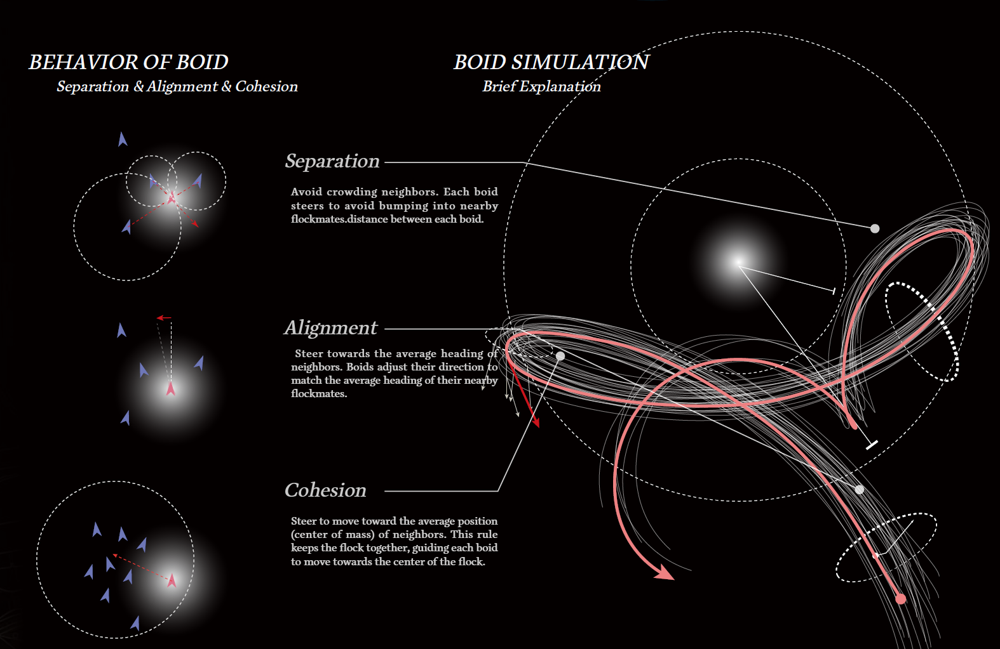
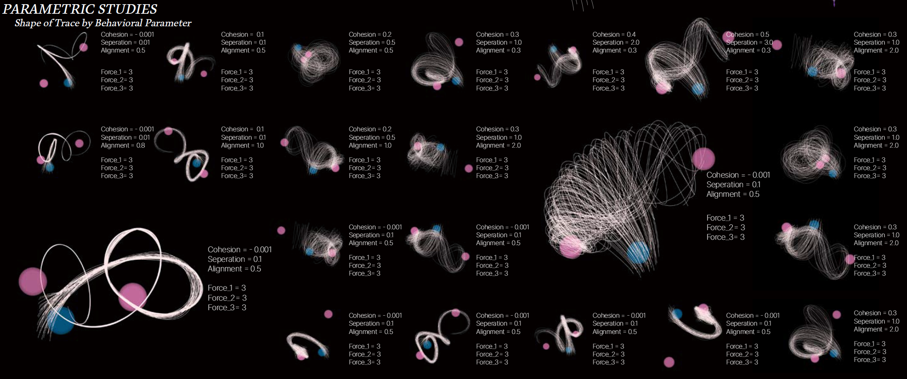
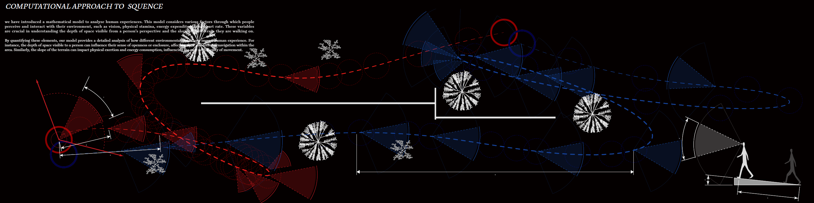
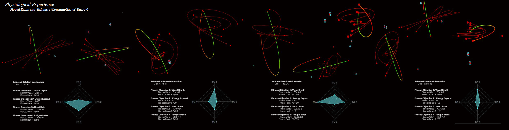

# Human 2 Experience

## 0. Reference Paper

## 1. Project Aim
This is code that I used for my graduate thesis project. In this project, I have introduced a mathematical model to analyze human experiences. This model considers various factors through which people perceive and interact with their environment, such as vision, physical stamina, energy expenditure, and heart rate. These variables are crucial in understanding the depth of space visible from a person's perspective and the slope of the terrain they are walking on.

By quantifying these elements, my model provides a detailed analysis of how different environmental conditions impact human experience. For instance, the depth of space visible to a person can influence their sense of openness or enclosure, affecting their comfort and navigation within the area. Similarly, the slope of the terrain can impact physical exertion and energy consumption, influencing the ease or difficulty of movement.

Through this approach, I aim to design environments that are not only functional but also enhance the well-being and comfort of their users. By considering the physiological and perceptual responses of individuals, my design can cater to the needs of the people who use these spaces daily. This integration of human-centric data into the design process allows me to create more inclusive, accessible, and enjoyable environments.

In this project, rather than focusing solely on creating traditionally 'good' spaces, my primary goal has been to provide diverse experiences for individuals as they walk through these environments. I recognize that perceptions of a 'good' space can vary greatly depending on personal backgrounds and preferences. Therefore, my approach has been to enrich the walking experience by considering a wide range of factors that influence human perception and comfort. By doing so, I aim to create environments that offer varied and engaging experiences, catering to a broader spectrum of individual needs and enhancing the overall interaction with the space.

## 2. Pedestrian Simulation

  
  
  

## 3. Experience
### Human Experience Modeling on an Uphill Path
This project focuses on modeling the human experience while walking uphill by considering various factors such as energy expenditure, heart rate, fatigue, and the depth of vision. These factors are linearly weighted to define the overall experience perceived by individuals.

  

#### Energy Expenditure Calculation
The energy expenditure (E) while walking uphill is calculated using the formula:

$$E = MET * Weight (kg) * Time (hours)$$

### Target Heart Rate Calculation
The target heart rate (HR_target) is determined using the Karvonen formula:

$$HR_{target} = HR_{rest}+ Exercise Intensity * (HR_{max} - HR_{rest})$$

where,

$$HR_{rest} : \text{resting heart rate}$$

$$HR_{max} : \text{Maximum heart rate} (\text{where, } HR_{max} = 220 - \text{Age})$$

$$\text{Exercise Intensity} \subset [0,1]$$

#### Fatigue Index Calculation
The fatigue index (F) incorporates energy expenditure and heart rate:

$$F = αE + βHR + γM$$

where,

  
$$E$$ : Energy Expenditure

$$HR$$ : Heart Rate

$$M$$ : Fatigue Index

$$α, β, γ$$ : weights

#### Vision Depth Heat Map
The depth of vision or visibility range at each point along the uphill path is represented as a heat map. This provides insight into how the surroundings impact a person's experience and movement.

#### Overall Experience Calculation
The overall experience (X) felt by a person while walking uphill is defined by linearly weighting the factors of energy, heart rate, fatigue, and vision depth:

$$X = δ HR_{target} + ε E + ζ VO2_{max} + η V$$

where,

  
$$HR_{target}$$ : Target Heart Rate

$$E$$ : Energy Expenditure

$$VO2_{max}$$ : Maximum Oxygen Uptake

$$V$$ : Vision Depth

$$δ, ε, ζ, η$$ : weights

#### Visualization
The graph presents pathways colored to reflect fatigue levels at various points, with a heat map overlay indicating the depth of vision. This dual representation helps understand how physical effort and visual perception impact the overall human experience.

Applications
Site Design Optimization: Improve pathways, place amenities strategically, and manage crowd flow effectively.
Safety and Efficiency: Enhance safety by identifying bottlenecks and high-traffic areas.
Personalized Experiences: Develop tailored services for different demographic groups based on movement patterns and preferences.
This model serves as a valuable tool for urban planners, event organizers, and site managers, providing actionable insights to improve the overall experience for visitors.
## 4. Optimize

  

## 5. Program Structure
